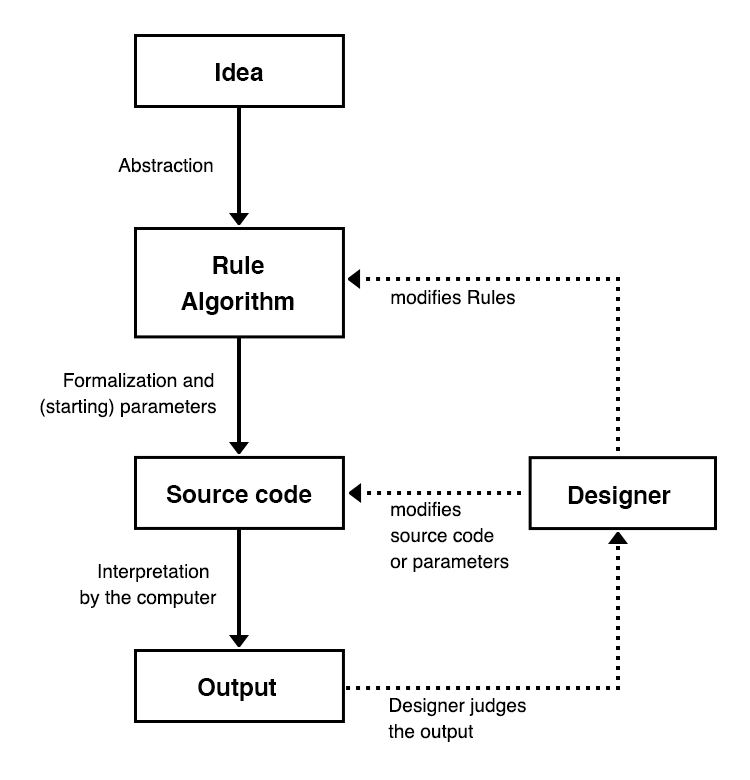

# Regenerative

Create a dynamic web page that uses data to change its presentation

Images (from left): [Generative Splines](https://www.behance.net/gallery/40247813/Generative-Splines) Hyper Glu; [Arc Bicycle](https://www.futura-sciences.com/tech/actualites/imprimante-3d-arc-bicycle-decouvrez-premier-velo-imprime-3d-soudage-91153/) Delft University of Technology (2016); [The Sherwin Series](https://joelledietrick.com/site/sherwin) Joelle Dietrick (2011); [Heydar Aliyev Centre](https://www.zaha-hadid.com/architecture/heydar-aliyev-centre/) Zaha Hadid (2012) 

Learning Objectives

Students who complete the following will be able to:

- Describe how data is used to create generative processes in software, design, architecture, etc.
- Compare outcomes of generative processes across different disciplines.
- Write pseudo code to represent the procedural, data-driven process, and then code it with JS in a prototype
- Use HTML, CSS, JS to create the final application
- Design an identity for the project that communicates the theme or concept of the project

Preparation

Complete the following to prepare for this assignment

### Concept

- Dan Howarth “[Generative Design Software Will Give Designers ‘Superpowers’](https://www.dezeen.com/2017/02/06/generative-design-software-will-give-designers-superpowers-autodesk-university/)” Dezeen, 2017 [video](https://www.youtube.com/watch?v=h7gq7OrbgxY) (2:18)
- Eduardo Souza “[How Will Generative Design Impact Architecture?](https://www.archdaily.com/937772/how-will-generative-design-impact-architecture)” ArchDaily, 2020
-  Samantha Pires [The Architecture of Zaha Hadid: 10 Great Buildings by the Queen of the Curve](https://mymodernmet.com/zaha-hadid-buildings-queen-of-the-curve/), 2021

### Technical

- [Codecademy: JS 3-1 Functions](https://www.codecademy.com/learn/introduction-to-javascript) (1-7)
- [Codecademy: JS 4-1 Scope](https://www.codecademy.com/learn/introduction-to-javascript) (1-4)
- [Codecademy: JS 5-1 Arrays](https://www.codecademy.com/learn/introduction-to-javascript) (1–7)
- [Codecademy: JS 6-1 Loops](https://www.codecademy.com/learn/introduction-to-javascript) (1–7)
- Javascript.info JS [Comparison](https://javascript.info/comparison), [Logical operators](https://javascript.info/logical-operators), [Functions](https://javascript.info/function-basics), [Loops: while and for](https://javascript.info/while-for)

### Examples

Critical Web Design / Radical Software [examples tagged with #generative or #remix](https://docs.google.com/spreadsheets/d/1mQ0doWT6tGXm2W-hB5zuz3I8mijGhLSkAe_XrcfMdok/edit#gid=0)

## About

This assignment asks you to create a web page that taps into data-driven processes. On one hand, almost all software and website you interact with somehow generates an interface using information from a database. Even boring shopping websites use cookies to identify and customize pages for users, which they [sometimes use against their own customers](https://www.justice.gov/opa/pr/amazon-marketplace-seller-pleads-guilty-price-fixing-dvds-and-blu-ray-discs).

However, Generative Design is a larger cultural trend that, similar to data-driven websites, use algorithms to create (and recreate) designs and concepts for architecture, objects, behaviors, animations, games, and much more. Regardless of your approach, your project should mimic these processes, using code and data, similar to the following diagram from the book, [Generative Design: Visualize, Program, and Create with JavaScript in p5.js](http://www.generative-gestaltung.de/) by Groß, Bohnacker, and Laub.

## Instructions

- [ ] Fork this repository and clone it to your `critical-web-design` folder on your machine.
- [ ] Develop a concept for your project using the materials above.
- [ ] Use Figma to create a wireframe and design iterations for your project.

#### Code

- [ ] Use HTML, CSS, and JS to code your design inside `index.html`
- [ ] Use Javascript variables, conditional logic, loops, etc. to somehow change the page every time it loads.
- [ ] Use images, other media, or code libraries as needed.

#### Publish
- [ ] [Save and refresh](https://github.com/omundy/learn-computing/blob/main/topics-keyboard-shortcuts.md#web-development-edit-save-refresh-loop) your work in the browser often to see your changes.
- [ ] Commit changes regularly.
- [ ] Confirm valid [HTML](https://validator.w3.org/) and [CSS](https://jigsaw.w3.org/css-validator/) [(?)](https://github.com/omundy/dig245-critical-web-design/blob/main/reference-sheets/css.md#css-validation)
- [ ] When finished, [push, publish, and post your project](https://docs.google.com/document/d/17U_zmzM_eML_qkG0PaOdDRcEk3YEmbiQ1TyNnbAM08k/edit#bookmark=id.8jryplv1i8a)

Grading

Points | Category | Description
---: | --- | ---
4 | Concept | Idea is original and evokes deeper thinking on the subject.
4 | Design | Overall quality and use of design principles; Graphics are consistent, layout displays clear information hierarchy
4 | Execution | Concept and design is well-executed, is usable, and functions as intended
4 | Instructions | Project is online, accessible, and linked from Moodle
4 | Validation | Valid HTML and CSS
20 | Total |

## Resources

- Course references [HTML](https://github.com/omundy/dig245-critical-web-design/blob/main/reference-sheets/html.md), [CSS](https://github.com/omundy/dig245-critical-web-design/blob/main/reference-sheets/css.md), and [JS](https://github.com/omundy/dig245-critical-web-design/blob/main/reference-sheets/javascript.md)
